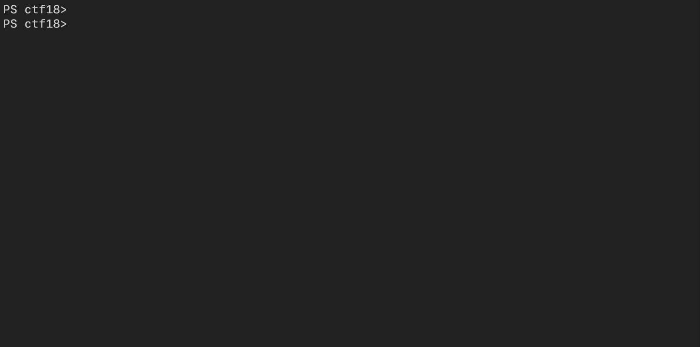

# **ctf18**



`ctf18` is a docker image based on Ubuntu 18.04 for information security education, especially for CTF and wargame practice.


## **Table of Contents**

  - [**Features**](#features)
    - [Terminal](#terminal)
    - [Editor](#editor)
    - [Offensive Security](#offensive-security)
    - [Utilities](#utilities)
  - [**Installation**](#installation)
    - [Docker Installation](#docker-installation)
    - [Running the Image](#running-the-image)
  - [**Troubleshooting**](#troubleshooting)
    - [docker-compose command fails](#docker-compose-command-fails)
    - [pwntools gdb integration is not working](#pwntools-gdb-integration-is-not-working)


## **Features**

There are a lot of pre-installed packages and applications in `ctf18` .

### Terminal

- zsh and [oh-my-zsh](https://github.com/ohmyzsh/ohmyzsh)
- [fzf](https://github.com/junegunn/fzf)  (fuzzy finder) with configured [examples](https://github.com/junegunn/fzf/wiki/examples) (e.g. `cdf`)
- [tmux](https://github.com/tmux/tmux/wiki) (terminal multiplexer)

### Editor

- [Neovim](https://neovim.io/) with [vim-plug](https://github.com/junegunn/vim-plug)
- [coc.nvim](https://github.com/neoclide/coc.nvim) for autocompletions
  - C/C++ ([coc-clangd](https://github.com/clangd/coc-clangd))
  - Python ([coc-pyright](https://github.com/fannheyward/coc-pyright))
  - Javascript ([coc-tsserver](https://github.com/neoclide/coc-tsserver))

### Offensive Security
- [pwntools](https://github.com/Gallopsled/pwntools) for exploit writing
- [pwndbg](https://github.com/pwndbg/pwndbg) on gdb 10.1 built from source
- [radare2](https://github.com/radareorg/radare2) for binary analysis
- [z3py](https://ericpony.github.io/z3py-tutorial/guide-examples.htm) (SMT solver)

### Utilities

- Modern tools
  - [hexyl](https://github.com/sharkdp/hexyl) - alternative `xxd`
  - [bat](https://github.com/sharkdp/bat) - alternative `cat`


## **Installation**

### Docker Installation

You should have docker installed on your machine to use `ctf18`. Check out official docker docs for installation.
- [Install Docker Desktop on Windows](https://docs.docker.com/docker-for-windows/install/)
- [Install Docker Desktop on Mac](https://docs.docker.com/docker-for-mac/install/)
- [Install Docker Engine](https://docs.docker.com/engine/install/) (for Linux)

Note that Linux users should also install docker compose in addition.
- [Install Docker Compose](https://docs.docker.com/compose/install/) (for Linux)

### Running the Image

After you are done with docker installation, `git clone` this repository and run the following command.

```bash
docker-compose run --rm ctf18
```

The first-time run would cost about 15~20 minutes for building the image depending on your internet connection.


## **Troubleshooting**

If you have found issues not described in here, please report it through issues.

### `docker-compose` command fails

Docker desktop should be running on your machine before launching the image. In Windows, [not enabled WSL2](https://docs.docker.com/docker-for-windows/wsl/) could be one reason.

### pwntools gdb integration is not working

I have found that some recent versions of pwntools have issues with gdb integration. First, disable auto updating feature of pwntools.

```bash
echo never > ~/.cache/.pwntools-cache-*/update
```

Then downgrade the version to at least 4.3.1.

```bash
python -m pip install pwntools==4.3.1
```